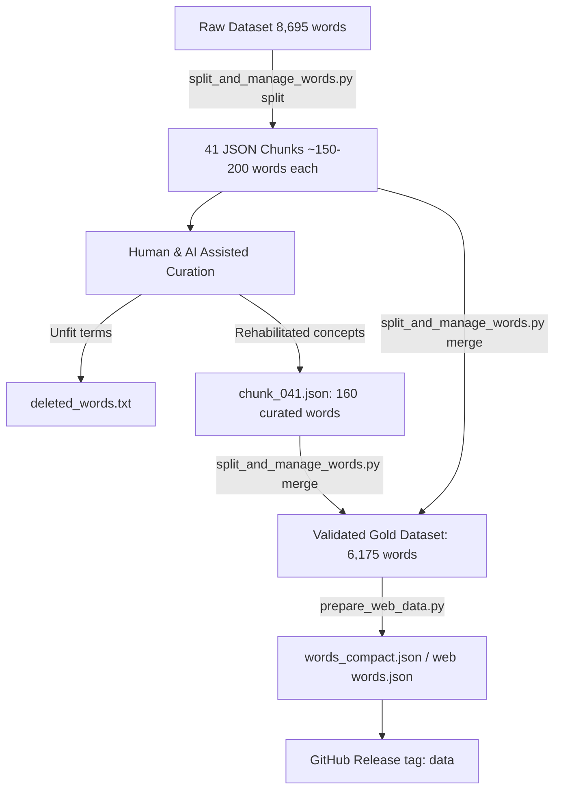

# Dataset Curation, Chunking, Rehabilitation & Merging — Engineering Journey

## 1. Overview & Objectives

Following the initial generation of 8,695 raw concepts from 170 thematic queries via the DeepSeek API, this phase addressed dataset quality, icon feasibility on the official *Concept* board, deduplication, and repository hygiene.

The goal was to transform raw AI outputs into a **gold-standard, board-tested French dictionary** of 6,175 rich, fun, and iconable concepts:

1. **Granular Chunk Management**: Developing [`scripts/split_and_manage_words.py`](file:///d:/maxisoft/PycharmProjects/Concept/scripts/split_and_manage_words.py) to split the monolithic dataset into 41 manageable chunks for human review.
2. **Systematic Pruning & Filtering**: Identifying uniconable jargon, duplicates, typos, and overly abstract entries, extracting them into [`res/words/deleted_words.txt`](file:///d:/maxisoft/PycharmProjects/Concept/res/words/deleted_words.txt).
3. **Concept Rehabilitation Pipeline**: Reviewing filtered words and re-introducing 160 high-value, perfectly playable concepts with validated icon paths on the *Concept* game board.
4. **Hierarchical Category Integrity**: Preserving the strict 4-level semantic hierarchy (`query_indices` levels 0–3) across all merged chunks.
5. **Git Repository Hygiene & BFG Sanitization**: Stripping gigabytes of temporary chunk history and raw dumps using **BFG Repo-Cleaner**, tracking exclusively `deleted_words.txt`, and publishing the consolidated dataset to GitHub Release `data`.

---

## 2. The Chunking & Validation Pipeline

### 🧩 The Chunk Manager (`scripts/split_and_manage_words.py`)
To enable parallel and iterative review without risking data loss on a single large file, we created a specialized Python CLI tool:
- **`split`**: Splits `res/words_generated.json` into ~41 chunks indexed with zero-padded names (`chunk_001.json` to `chunk_041.json`).
- **`validate`**: Asserts strict JSON schema compliance, checks difficulty bounds (`d ∈ [0, 2]`), complexity score (`c ∈ [0, 1]`), commonality score (`cc ∈ [0, 1]`), and verifies that all `query_indices` map to existing prompt themes (`0` to `169`).
- **`merge`**: Re-aggregates all chunks, performs global deduplication on normalized lemmas (`w.strip().lower()`), preserves the hierarchical ordering of query indices, and produces the consolidated dataset.

---

## 3. Pruning, Filtering & Rehabilitation

### ❌ Pruning Criteria
During the review, entries were removed if they violated game design criteria:
- **Abstract jargon without icons**: Philosophical or bureaucratic phrases impossible to represent with board universal icons.
- **Duplicate inflections / near-synonyms**: Feminine/plural variants or slight permutations of already existing concepts.
- **Unverified pop culture & obscure references**: Extremely niche items with low recognition (`cc < 0.20`).
- **Artifacts & formatting errors**: Leftover markdown brackets, parentheses, or misplaced punctuation.

Approximately 2,680 terms were extracted to [`res/words/deleted_words.txt`](file:///d:/maxisoft/PycharmProjects/Concept/res/words/deleted_words.txt).

### 🌟 Rehabilitation of 160 High-Value Concepts
A secondary pass evaluated candidate terms from `deleted_words.txt` against the physical *Concept* board icons (main concept `?`, secondary cubes `!`, colors, categories, sub-attributes). 

160 concepts were verified, re-attributed with precise difficulty ratings, and packaged into `chunk_041.json`:

| Category | Example Concepts | Difficulty | Demonstrated Board Icon Path |
| :--- | :--- | :---: | :--- |
| **Faune & Nature** | *Sanglier, Narval, Phénix, Salamandre* | `0`–`1` | 🟢 `?` **Faune** + Cubes sur **Bois/Forêt**, **Brun**, **Pointu/Défenses** |
| **Monuments & Géographie** | *Tour Eiffel, Pompéi, Canal de Panama* | `0`–`2` | 🟢 `?` **Bâtiment** + Cubes sur **France/Paris**, **Métal**, **Grand/Haut** |
| **Gastronomie & Cuisine** | *Boulangerie, Fondue savoyarde, Crêpe Suzette* | `0`–`1` | 🟢 `?` **Nourriture** + Cubes sur **Chaud/Feu**, **Fromage/Jaune**, **Partage** |
| **Culture, Cinéma & Fiction** | *Sherlock Holmes, Star Wars, Frankenstein* | `1`–`2` | 🟢 `?` **Personnage fictif** + Cubes sur **Chapeau**, **Loupe**, **Mystère/Enquête** |
| **Expressions & Événements** | *Bain de minuit, Coup de foudre, Poisson d'avril* | `1`–`2` | 🟢 `?` **Idée/Concept** + Cubes sur **Eau/Nuit**, **Amour/Éclair**, **Rire/Farce** |

The 93 reclaimed concepts were purged from `deleted_words.txt` to keep the deletion ledger pristine.

---

## 4. Semantic Hierarchy Preservation (Levels 0 to 3)

The *Concept* taxonomy organizes 170 thematic queries across 4 levels:
- **Level 0 (Root)**: Large domain (e.g., `0` *Objets*, `6` *Faune*, `24` *Histoire*).
- **Level 1 (Category)**: Specific area (e.g., *Mammifères*, *Moyens de transport*).
- **Level 2 (Sub-category)**: Granular specialization (e.g., *Animaux marins*, *Véhicules anciens*).
- **Level 3 (Fine theme)**: Specialized topic (e.g., *Créatures fantastiques sous-marines*).

During merging, `split_and_manage_words.py` sorts `query_indices` in ascending hierarchical order, ensuring that cards generated from multiple overlapping themes maintain balanced contextual hints.

---

## 5. Dataset Metrics & Git History Sanitization

### 📊 Final Dataset Statistics

| Metric | Before Curation | After Curation & Rehabilitation |
| :--- | :--- | :--- |
| **Total Unique Words** | 8,695 | **6,175** |
| **Difficulty 0 (Facile 🔵)** | 2,974 (34.2%) | **2,112 (34.2%)** |
| **Difficulty 1 (Moyen 🔴)** | 3,735 (43.0%) | **2,680 (43.4%)** |
| **Difficulty 2 (Difficile 🔘)** | 1,986 (22.8%) | **1,383 (22.4%)** |
| **Active Chunks** | Monolith | 41 validated chunks |
| **Raw JSON Size** | ~4.33 MB | **3.08 MB** |
| **Compact JSON (`words.json`)** | ~1.45 MB | **1.04 MB (Gzip ~240 kB)** |

### 🧹 BFG Repo-Cleaner & Release Assets
Because intermediate chunk edits and large JSON diffs would rapidly inflate the Git packfile:
1. **BFG Execution**: Ran `bfg --delete-folders temp_chunks` and purged intermediate generator caches from Git commit history.
2. **Git Garbage Collection**: `git reflog expire --expire=now --all && git gc --prune=now --aggressive`.
3. **Repository Rules**: Configured `.gitignore` to track **only** [`res/words/deleted_words.txt`](file:///d:/maxisoft/PycharmProjects/Concept/res/words/deleted_words.txt) within `res/words/`.
4. **GitHub Releases (`tag: data`)**: Hosted `words_generated.json`, `words_compact.json`, `words.json`, and `deleted_words.txt` directly on GitHub Release `data` for fast, CDN-cached downloads during CI/CD.
