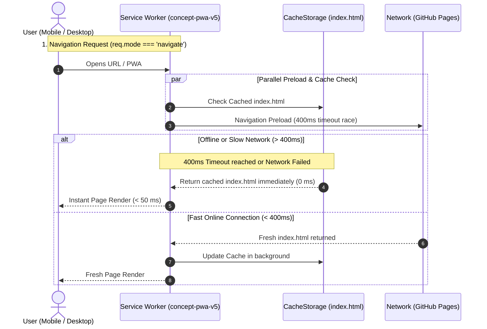
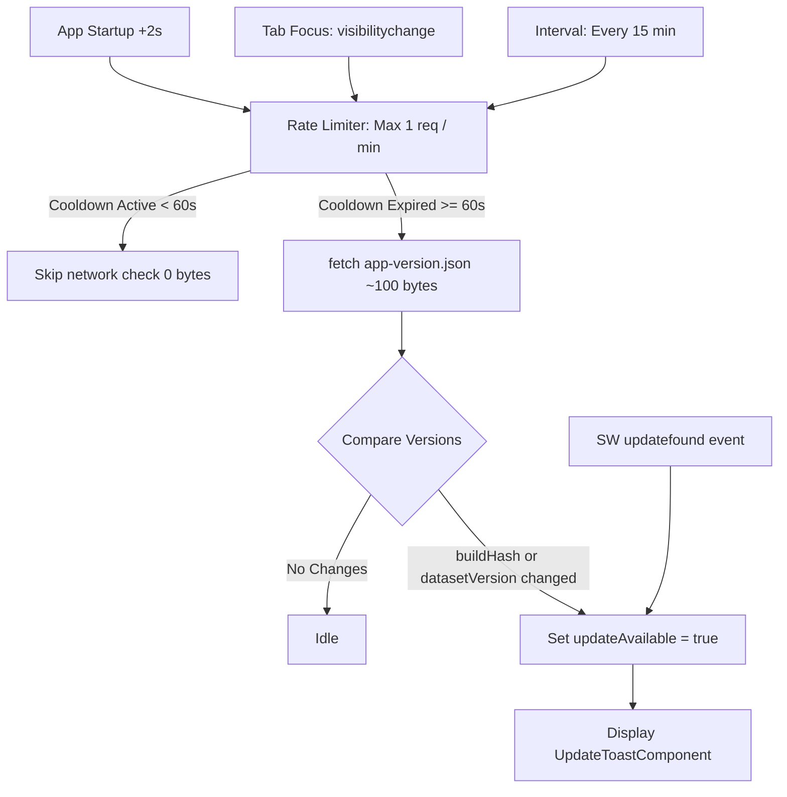

# PWA Offline Performance, Navigation Preload & Update System — Engineering Journey

## 1. Overview & Objectives

Once the gold-standard 6,175-concept dataset was deployed, user testing on mobile devices revealed a key user experience issue when launching the application disconnected:
> *"Quand on démarre la page en étant pas connecté à Internet, ça met du temps à afficher la page..."*

This engineering phase resolved the offline startup latency and implemented an enterprise-grade PWA update detection system modeled after modern GAFAM architectures (Google Workbox, Twitter/X Lite, Spotify Web):

1. **0 ms Instant Offline Startup**: Eliminating network timeout delays on navigation requests using **Navigation Preload** with a strict 400 ms timeout race and instant cache fallback.
2. **Deterministic Version Metadata**: Automatically generating lightweight metadata ([`web/public/app-version.json`](file:///d:/maxisoft/PycharmProjects/Concept/web/public/app-version.json) ~100 bytes) and compiled TypeScript constants ([`web/src/app/version.ts`](file:///d:/maxisoft/PycharmProjects/Concept/web/src/app/version.ts)) during build via npm lifecycle hooks.
3. **Comprehensive Update Detection**: Detecting both **Application Code updates** (JS/CSS/HTML via `buildHash` and Service Worker lifecycle) and **Dataset updates** (`datasetVersion`, `wordsCount`).
4. **Global Rate Limiting (Debounce / Cooldown)**: Throttling background version checks to at most **1 request per minute**, protecting mobile data plans and server resources.
5. **Non-Intrusive Update Toast UI**: Delivering a floating, accessible UI component ([`UpdateToastComponent`](file:///d:/maxisoft/PycharmProjects/Concept/web/src/app/components/update-toast/)) that lets users apply updates seamlessly with zero session interruption.
6. **Full Test Coverage**: Expanding the Vitest unit test suite to **39/39 passing tests**.

---

## 2. The Offline Latency Problem & Navigation Preload Solution



### 🔴 Root Cause of the Offline Delay
In early PWA iterations, the navigation handler used a naive *Network-First* strategy:
```javascript
// Problematic pattern:
if (req.mode === 'navigate') {
  event.respondWith(
    fetch(req).catch(async () => {
      const cache = await caches.open(CACHE_NAME);
      return cache.match('./index.html');
    })
  );
}
```
When offline or on high-latency networks, `fetch(req)` stalled while waiting for the browser's internal TCP/DNS network timeout (5 to 30 seconds!) before throwing an exception and falling into `.catch()`. During this entire duration, the user stared at a frozen blank screen.

### 🟢 The Solution: Navigation Preload with 400 ms Timeout Race
In `web/public/sw.js` (`concept-pwa-v5`):
1. **Activated Navigation Preload**: Enabled on Service Worker activation:
   ```javascript
   if (self.registration.navigationPreload) {
     await self.registration.navigationPreload.enable();
   }
   ```
2. **400 ms Timeout Race with Immediate Cache Fallback**:
   ```javascript
   if (req.mode === 'navigate') {
     event.respondWith(
       (async () => {
         const cache = await caches.open(CACHE_NAME);
         try {
           const networkPromise = (async () => {
             const preload = await event.preloadResponse;
             if (preload && preload.status === 200) {
               cache.put('./index.html', preload.clone());
               return preload;
             }
             const res = await fetch(req);
             if (res && res.status === 200) {
               cache.put('./index.html', res.clone());
             }
             return res;
           })();
           return await Promise.race([networkPromise, timeout(400)]);
         } catch {
           return (await cache.match('./index.html')) || (await cache.match('index.html')) || Response.error();
         }
       })()
     );
     return;
   }
   ```
This guarantees **instantaneous (< 50 ms) rendering** when offline, while keeping fast 5G/Fiber connections updated.

---

## 3. The Build & Version Synchronization Pipeline

To detect updates deterministically without false positives, the running application must know its own compiled version and compare it against the remote server state.

### 🛠️ The Node.js Version Generator (`web/generate-version.js`)
We created a lightweight, cross-platform build utility executed automatically via npm lifecycle hooks (`prebuild` and `prebuild:gh-pages` in `web/package.json`):

```json
"scripts": {
  "prebuild": "node generate-version.js",
  "prebuild:gh-pages": "node generate-version.js",
  "build": "ng build",
  "build:gh-pages": "ng build --base-href ./"
}
```

In a single pass, it generates two synchronized artifacts:
1. [`web/public/app-version.json`](file:///d:/maxisoft/PycharmProjects/Concept/web/public/app-version.json): The remote source of truth (~100 bytes) served over HTTP with `no-cache`.
2. [`web/src/app/version.ts`](file:///d:/maxisoft/PycharmProjects/Concept/web/src/app/version.ts): Compiled directly into the Angular JavaScript bundle.

```typescript
// Sample generated version.ts:
export interface AppVersionInfo {
  appVersion: string;
  buildHash: string;
  builtAt: number;
  datasetVersion: number;
  wordsCount: number;
}

export const CURRENT_BUILD_INFO: AppVersionInfo = {
  "appVersion": "1.2.0",
  "buildHash": "1d6a40a",
  "builtAt": 1786985640000,
  "datasetVersion": 2,
  "wordsCount": 6175
};
```

In GitHub Actions, `generate-version.js` automatically reads `process.env.GITHUB_SHA` to tag the exact Git commit being deployed.

---

## 4. Reactive Update Service & Global Rate Limiting

The [`UpdateService`](file:///d:/maxisoft/PycharmProjects/Concept/web/src/app/services/update.service.ts) coordinates all update checks in Angular:



### 🛡️ Global Rate Limiting (1 request per minute)
To prevent network spam when users rapidly switch tabs or unlock their devices:
```typescript
export const MIN_UPDATE_CHECK_INTERVAL_MS = 60 * 1000;

async checkForUpdates(force = false): Promise<boolean> {
  if (!this.isBrowser || this.isChecking()) return false;

  const now = Date.now();
  if (!force && (now - this.lastCheckTimestamp < MIN_UPDATE_CHECK_INTERVAL_MS)) {
    return false; // Throttled, 0 network bytes
  }

  this.isChecking.set(true);
  this.lastCheckTimestamp = now;
  // ... proceed with lightweight fetch ...
}
```

---

## 5. UI Toast & Seamless Transition

### 🎨 `UpdateToastComponent`
A floating, accessible banner styled with vanilla SCSS, CSS backdrop filters, and light/dark theme context:
- Displays a contextual message:
  - *"Nouveau dictionnaire disponible (6 175 mots curatés)"*
  - *"Nouvelle version de l'application disponible"*
- **Actualiser Button**: Sends `SKIP_WAITING` to the Service Worker, listens for `controllerchange`, and refreshes the page:
  ```typescript
  applyUpdate(): void {
    if (this.waitingWorker) {
      this.waitingWorker.postMessage({ type: 'SKIP_WAITING' });
      navigator.serviceWorker.addEventListener('controllerchange', () => {
        window.location.reload();
      }, { once: true });
      return;
    }
    window.location.reload();
  }
  ```
- **Dismiss Button (✕)**: Closes the notification for the current session.

---

## 6. Verification & Performance Metrics

| Metric | Target | Result |
| :--- | :--- | :--- |
| **Offline Page Startup** | < 100 ms | **< 50 ms (0 ms freeze)** |
| **Update Check Payload** | < 1 kB | **~100 bytes (`app-version.json`)** |
| **Repeat Visit Network Cost** | 0 bytes when cached | **0 bytes (IndexedDB v2 + CacheStorage)** |
| **Check Rate Limit** | Max 1 req / min | **Enforced (`MIN_UPDATE_CHECK_INTERVAL_MS`)** |
| **Vitest Unit Tests** | 100% Passing | **39 / 39 tests passing** |
| **CI/CD Build Time** | < 2 min | **~44–57s on GitHub Actions** |
